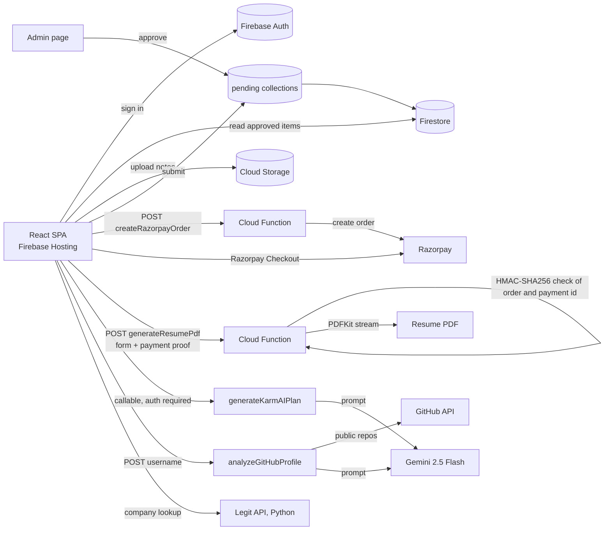

# CampusConnect

A student platform for Indian universities: shared study material, a resume builder with paid PDF export, and AI tools for career planning.

**Live:** [campusconnect.studio](https://campusconnect.studio)
**Stack:** React 18 · Vite · Tailwind CSS · Firebase (Auth, Firestore, Storage, Hosting) · Cloud Functions (Node.js 20) · Razorpay · Google Gemini · PDFKit

<!-- Add a 60-second demo GIF here: docs/demo.gif -->

## What it does

| Feature | How it works |
| --- | --- |
| Academic material | Students browse notes and papers by university, course, branch and year. Uploads go to a pending queue and an admin approves them before they are public. |
| Resume generator | A Cloud Function streams an ATS-friendly PDF with PDFKit. Free downloads carry a watermark; paying ₹49 through Razorpay removes it. |
| KarmAI career plan | Signed-in students enter education, skills and goals; a callable function asks Gemini 2.5 Flash for a structured learning plan. |
| Forensic skill analyzer | Fetches a user's 10 most recent public repos, trims them to name, language, stars and description, and asks Gemini for a skills assessment. |
| Company check | Looks up a company and shows a legitimacy report from a separate Python API (`legit-api`). |
| Local services | A directory of services near campus (mess, water suppliers and more), with the same submit → admin-approve flow. |

## Architecture



## Decisions worth explaining

- **Payment is verified on the server, never trusted from the browser.** The client sends `orderId`, `paymentId` and `signature`; the function recomputes `HMAC-SHA256(orderId|paymentId, key_secret)` and removes the watermark only on a match.
- **PDFs are streamed, not stored.** PDFKit writes straight into the HTTP response, so there is no file to clean up and no student data kept in storage.
- **User content is moderated before it is public.** Uploads land in `pendingAcademicMaterials` / `pendingLocalServices`; only the admin page moves them into the public collections.
- **AI calls stay on the server.** Gemini keys live in Cloud Functions environment config, and the KarmAI function rejects unauthenticated calls.

## Known limitations (next steps)

- A valid payment signature can be reused for more resumes. Fix: store used `paymentId`s in Firestore and reject repeats.
- Signature comparison should use `crypto.timingSafeEqual`.
- No automated tests yet; next is function tests with `firebase-functions-test` and the emulator.
- `analyzeGitHubProfile` has no rate limit; add per-IP limits or require sign-in.

## Run locally

```bash
npm install
npm run dev                 # front end on http://localhost:5173

cd functions && npm install
# functions/.env (not committed):
#   RAZORPAY_KEY_ID=...  RAZORPAY_KEY_SECRET=...  GEMINI_API_KEY=...
npm run serve               # Firebase emulators
```

Deploy: `npm run build && firebase deploy`.

## Author

Sujeet Singh · [LinkedIn](https://www.linkedin.com/in/sujeetkarmatix) · [GitHub](https://github.com/Karma-tic)
